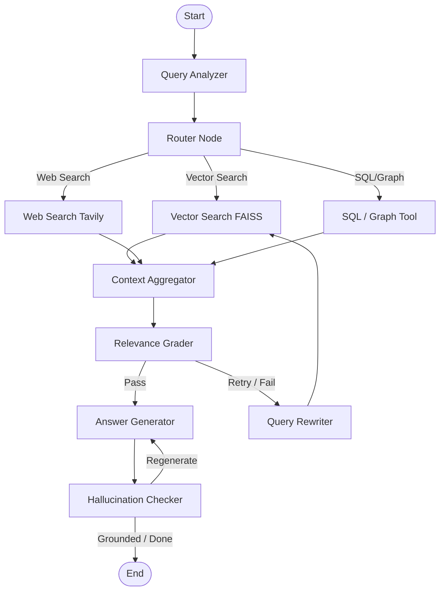

# Agentic RAG System

An advanced, state-of-the-art Agentic RAG (Retrieval-Augmented Generation) system built using **LangGraph** and **LangChain**. The system implements an orchestrator-agent architecture that dynamically analyzes queries, routes retrieval to vector stores, web search, or structured databases, grades retrieved context, rewrites queries for better performance, and guards against hallucinations.

---

## 🛠️ System Requirements & Setup

This project is built and optimized for **Python 3.11**. A virtual environment with the verified library versions is located in `agentic_venv/`.

### 1. Python Environment
- **Python Version**: `3.11.x` (Tested and verified with `Python 3.11.0`)

### 2. Installing Dependencies
If you need to install the dependencies in another environment, run:
```bash
pip install -r requirements.txt
```

### 3. Environment Variables
Create a `.env` file in the root directory to store your credentials:
```env
OPENAI_API_KEY=your-openai-api-key
TAVILY_API_KEY=your-tavily-api-key
```

---

## 🏗️ Architecture & Workflow

The orchestration graph is designed using a state machine (`StateGraph`) consisting of the following nodes and edges:



### Node Descriptions

1. **Query Analyzer**: Classifies the query format (conversational, database-oriented, search-oriented) and decomposes complex queries into sub-queries.
2. **Router Node**: Directs the query to the most appropriate data retrieval tool.
3. **Vector Search (FAISS)**: Retrieves semantic chunks from the local PDF/Text vector store.
4. **Web Search (Tavily)**: Leverages Tavily's web search API when local data is insufficient.
5. **SQL/Graph Database Tool**: Queries structured records or relational data.
6. **Context Aggregator**: Deduplicates, merges, and ranks documents retrieved from multiple streams.
7. **Relevance Grader**: Uses an LLM to evaluate if the aggregated context contains enough information to answer the user query.
8. **Query Rewriter**: Expands, simplifies, or reformulates the query if the relevance check fails.
9. **Answer Generator**: Synthesizes the final response.
10. **Hallucination Checker**: Verifies that the output is grounded solely in the retrieved context.

---

## 🚀 Running the Project

To execute the main orchestrator graph, use the local Python interpreter with the `PYTHONPATH` set to the `agentic_rag` directory:

### Windows (PowerShell)
```powershell
$env:PYTHONPATH="agentic_rag"; .\agentic_venv\python.exe main.py
```

### Windows (CMD)
```cmd
set PYTHONPATH=agentic_rag && .\agentic_venv\python.exe main.py
```

### Linux/macOS
```bash
PYTHONPATH=agentic_rag ./agentic_venv/bin/python main.py
```
